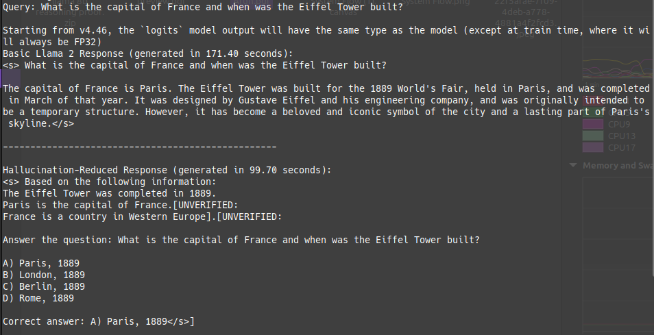

# Quest 1: Hallucination Problem

The script defines a framework for comparing two types of language models: a basic model (`BasicLlama2`) and an advanced model (`Llama2HallucinationReducer`) designed specifically to reduce hallucinations in the generated text.

Let's break down the components of the script conceptually and highlight the changes made for hallucination reduction.

## Components Overview

1. **BaseLM Class**:
   - An abstract base class that provides a common structure for different language models.
   - It initializes the device (CPU/GPU), loads a pretrained Llama model, and provides a method for generating text based on a given prompt.
   - **Key Method**: `_generate` handles the generation of text using the loaded model.

2. **BasicLlama2 Class**:
   - Inherits from `BaseLM`.
   - Implements the `generate_response` method, which simply calls the `_generate` method to produce a response to a query.
   - **Contribution**: Acts as a baseline model for comparison.

3. **Llama2HallucinationReducer Class**:
   - Inherits from `BaseLM` but adds components aimed at reducing hallucinations.
   - **Key Components**:
     - **Embedding Model**: Uses `SentenceTransformer` to embed documents and facts into a vector space for similarity comparisons.
     - **Document Store and Fact Database**: Stores relevant documents and verified facts to ensure responses are grounded in actual knowledge.
     - **Knowledge Graph**: A graph structure to represent relationships between entities, aiding in the contextual understanding of queries.

4. **Methods of Llama2HallucinationReducer**:
   - **set_document_store**: Loads and embeds documents to be used for retrieval.
   - **set_fact_database**: Loads and embeds verified facts.
   - **build_knowledge_graph**: Constructs a graph from triples (subject, predicate, object) that helps in contextual reasoning.
   - **retrieval_augmented_generation**: Augments the model's response by retrieving similar documents based on cosine similarity to the query embedding.
   - **knowledge_graph_generation**: Generates a response based on the knowledge graph, providing contextually relevant information.
   - **fact_verification**: Validates the generated response against the facts database, marking unverified information to mitigate false claims.

5. **Entity Extraction**:
   - A simple method to extract entities from text. In a more sophisticated setup, a Named Entity Recognition (NER) model would be employed.

## Changes Implemented for Hallucination Reduction

### 1. Grounded Generation

This involves constraining the LLM's outputs to verified information sources. Some approaches include:

- **Embedding and Similarity Search**:
   - The use of `SentenceTransformer` allows for semantic similarity comparisons between the query and stored documents/facts. This helps in ensuring that the model's response is based on relevant and factual information.
   - **Contribution**: Reduces the risk of generating hallucinated content by grounding responses in retrieved documents.

- **Retrieval-Augmented Generation**:
   - By augmenting the prompt with retrieved documents, the model is provided with contextual information that is more likely to be accurate and relevant.
   - **Contribution**: Enhances the model's response by anchoring it to verified content, minimizing inaccuracies.

- **Knowledge Graph Integration**:
   - Utilizing a knowledge graph allows the model to leverage relationships between entities, improving the context and relevance of responses.
   - **Contribution**: Helps to create more coherent and contextually accurate answers, reducing instances of hallucination.

## 2. Fact Verification
The implementation of a fact-checking mechanism post-generation ensures that the generated text aligns with a predefined set of verified facts. Any unverified claims are flagged.

**Contribution**: This mechanism acts as a safety net, reducing the likelihood of presenting incorrect information to the user.

## 3. Output Calibration:
Training models to express uncertainty or abstain from answering:

- Fine-tuning with carefully curated datasets that include "I don't know" or uncertainty expressions.
- Implementing threshold-based methods to detect low-confidence outputs.

## 4. Prompt Engineering
Designing prompts to elicit more accurate responses:

- Including explicit instructions to avoid speculation.
- Using `few-shot` examples demonstrating desired behavior.
- Implementing `chain-of-thought` prompting for complex reasoning tasks.

### Sample Output

> REMEMBER: These results are `cpu-based`, the time complexity decreases exponentially when run on `cuda-supported` devices.

